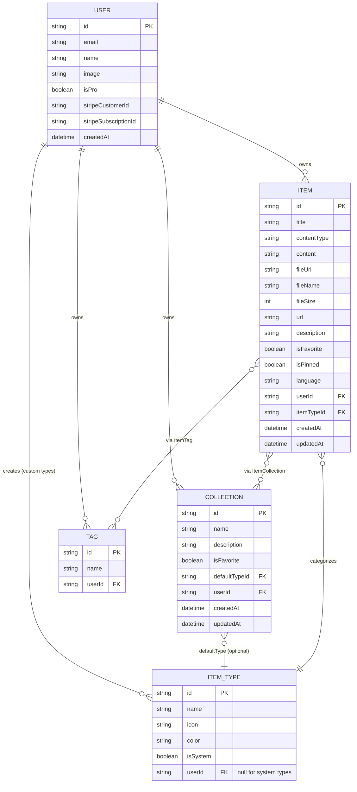
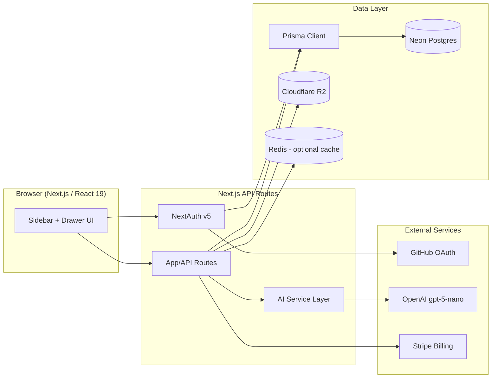

# 🗂️ DevStash — Project Overview

> One fast, searchable, AI-enhanced hub for all your dev knowledge — snippets, prompts, commands, links, notes, and files.

---

## 1. Problem

Developers keep their essentials scattered across too many tools:

| Scattered today | Where it usually lives |
|---|---|
| Code snippets | VS Code, Notion |
| AI prompts | Chat history |
| Context files | Buried in random projects |
| Useful links | Browser bookmarks |
| Docs | Random folders |
| Commands | `.txt` files, shell history |
| Project templates | GitHub Gists |

This fragmentation causes constant context-switching, lost knowledge, and inconsistent workflows.

**DevStash** solves this with a single, fast, searchable, AI-enhanced hub for all dev knowledge and resources.

---

## 2. Target Users

| Persona | Core need |
|---|---|
| 🧑‍💻 **Everyday Developer** | Fast capture/retrieval of snippets, prompts, commands, links |
| 🤖 **AI-First Developer** | Save and organize prompts, contexts, workflows, system messages |
| 🎓 **Content Creator / Educator** | Store code blocks, explanations, course notes |
| 🏗️ **Full-Stack Builder** | Collect reusable patterns, boilerplates, API examples |

---

## 3. Features

### A. Items & Item Types

Every piece of saved knowledge is an **Item**. Items have a **type**, which determines how content is stored and rendered.

**System types** (built-in, cannot be edited or deleted by users):

| Type | Content kind |
|---|---|
| `snippet` | text |
| `prompt` | text |
| `note` | text |
| `command` | text |
| `link` | url |
| `file` 🔒 Pro | file |
| `image` 🔒 Pro | file |

Users can also define **custom types** later (post-MVP).

- Content kinds: `text`, `url`, or `file`
- Type routes follow a predictable pattern, e.g. `/items/snippets`
- Items are designed to be created and viewed quickly inside a **slide-out drawer**, without a full page navigation

### B. Collections

- Users organize items into **Collections** (e.g. "React Patterns," "Context Files," "Python Snippets")
- Collections can hold items of **any type**
- Items are **many-to-many** with collections — a single React snippet can live in both "React Patterns" and "Interview Prep"
- UI shows which collections an item belongs to, and lets users add/remove it from multiple collections at once

### C. Search

Fast, unified search across:

- Content body
- Tags
- Titles
- Item type

### D. Authentication

- Email/password
- GitHub OAuth
- Powered by **NextAuth (Auth.js) v5**

### E. Core Product Features

- ⭐ Favorite items and collections
- 📌 Pin items to top
- 🕒 Recently used items
- 📥 Import code from a file
- 📝 Markdown editor for text-based types
- 📎 File upload for `file` / `image` types
- 📤 Export data in multiple formats
- 🌙 Dark mode (default)
- 🔗 Add/remove an item across multiple collections
- 👁️ View all collections an item belongs to

### F. AI Features (Pro only)

- 🏷️ AI auto-tag suggestions
- 📄 AI summaries
- 💡 AI "Explain This Code"
- ✨ AI prompt optimizer

> **Dev note:** All AI and Pro features are unlocked for every user during development. Gating logic should be built now so it's a config flip at launch, not a rebuild.

---

## 4. Data Model

### 4.1 Entity Relationship Diagram



### 4.2 Prisma Schema (draft)

> Draft only — not final. Written against **Prisma 7** + the standard Auth.js/NextAuth Prisma adapter models. All schema changes go through `prisma migrate dev` → `prisma migrate deploy`. **Never use `db push` or hand-edit the database.**

```prisma
// schema.prisma

generator client {
  provider = "prisma-client-js"
}

datasource db {
  provider = "postgresql"
  url      = env("DATABASE_URL")
}

// ---------------------------------------------------------------------------
// Auth.js (NextAuth v5) required models
// ---------------------------------------------------------------------------

model User {
  id            String    @id @default(cuid())
  name          String?
  email         String?   @unique
  emailVerified DateTime?
  image         String?
  password      String? // hashed, only set for credentials sign-up

  // Billing / plan
  isPro                Boolean   @default(false)
  stripeCustomerId     String?   @unique
  stripeSubscriptionId String?   @unique
  proSince             DateTime?

  accounts Account[]
  sessions Session[]

  items       Item[]
  itemTypes   ItemType[]
  collections Collection[]
  tags        Tag[]

  createdAt DateTime @default(now())
  updatedAt DateTime @updatedAt
}

model Account {
  id                String  @id @default(cuid())
  userId            String
  type              String
  provider          String
  providerAccountId String
  refresh_token     String? @db.Text
  access_token      String? @db.Text
  expires_at        Int?
  token_type        String?
  scope             String?
  id_token          String? @db.Text
  session_state     String?

  user User @relation(fields: [userId], references: [id], onDelete: Cascade)

  @@unique([provider, providerAccountId])
}

model Session {
  id           String   @id @default(cuid())
  sessionToken String   @unique
  userId       String
  expires      DateTime

  user User @relation(fields: [userId], references: [id], onDelete: Cascade)
}

model VerificationToken {
  identifier String
  token      String   @unique
  expires    DateTime

  @@unique([identifier, token])
}

// ---------------------------------------------------------------------------
// Core domain models
// ---------------------------------------------------------------------------

enum ItemContentKind {
  TEXT
  URL
  FILE
}

model ItemType {
  id       String  @id @default(cuid())
  name     String // "snippet" | "prompt" | "note" | "command" | "link" | "file" | "image" | custom
  icon     String // lucide icon name, e.g. "Code"
  color    String // hex, e.g. "#3b82f6"
  isSystem Boolean @default(false) // system types are seeded & immutable

  // null for system types, set for user-defined custom types
  userId String?
  user   User?   @relation(fields: [userId], references: [id], onDelete: Cascade)

  items              Item[]
  defaultForCollections Collection[]

  createdAt DateTime @default(now())

  @@unique([userId, name])
  @@index([userId])
}

model Item {
  id String @id @default(cuid())

  title       String
  description String?

  contentType ItemContentKind
  content     String? @db.Text // text content (snippet/prompt/note/command)
  language    String? // optional, for syntax highlighting on code-like types

  url String? // for `link` type

  fileUrl  String? // Cloudflare R2 object URL, for file/image types
  fileName String? // original filename
  fileSize Int? // bytes

  isFavorite Boolean @default(false)
  isPinned   Boolean @default(false)

  userId String
  user   User   @relation(fields: [userId], references: [id], onDelete: Cascade)

  itemTypeId String
  itemType   ItemType @relation(fields: [itemTypeId], references: [id])

  collections ItemCollection[]
  tags        ItemTag[]

  createdAt DateTime @default(now())
  updatedAt DateTime @updatedAt

  @@index([userId])
  @@index([itemTypeId])
  @@index([userId, isPinned])
  @@index([userId, isFavorite])
}

model Collection {
  id          String  @id @default(cuid())
  name        String
  description String?
  isFavorite  Boolean @default(false)

  // suggested type for new items added to an empty collection
  defaultTypeId String?
  defaultType   ItemType? @relation(fields: [defaultTypeId], references: [id])

  userId String
  user   User   @relation(fields: [userId], references: [id], onDelete: Cascade)

  items ItemCollection[]

  createdAt DateTime @default(now())
  updatedAt DateTime @updatedAt

  @@index([userId])
}

// Item <-> Collection (many-to-many)
model ItemCollection {
  itemId       String
  collectionId String
  addedAt      DateTime @default(now())

  item       Item       @relation(fields: [itemId], references: [id], onDelete: Cascade)
  collection Collection @relation(fields: [collectionId], references: [id], onDelete: Cascade)

  @@id([itemId, collectionId])
  @@index([collectionId])
}

model Tag {
  id     String @id @default(cuid())
  name   String
  userId String
  user   User   @relation(fields: [userId], references: [id], onDelete: Cascade)

  items ItemTag[]

  @@unique([userId, name])
}

// Item <-> Tag (many-to-many)
model ItemTag {
  itemId String
  tagId  String

  item Item @relation(fields: [itemId], references: [id], onDelete: Cascade)
  tag  Tag  @relation(fields: [tagId], references: [id], onDelete: Cascade)

  @@id([itemId, tagId])
  @@index([tagId])
}
```

**Open questions to resolve before finalizing the schema:**

- Should `Tag` be per-user (as modeled) or global/shared across users?
- Do we need soft-deletes (`deletedAt`) for items/collections, or hard deletes only?
- Should `ItemType.color` be an enum of a fixed palette, or free-form hex (custom types)?

---

## 5. Tech Stack

| Layer | Choice | Notes |
|---|---|---|
| Framework | [Next.js 16](https://nextjs.org/docs) / [React 19](https://react.dev/) | SSR pages with dynamic components; API routes for backend needs (items, uploads, AI calls); single repo |
| Language | TypeScript | End-to-end type safety |
| Database | [Neon](https://neon.tech/docs) (Postgres, serverless/cloud) | |
| ORM | [Prisma 7](https://www.prisma.io/docs) | ⚠️ Always use `prisma migrate` — never `db push` or manual schema edits, in dev or prod |
| Caching | Redis | Maybe — evaluate need post-MVP |
| File storage | [Cloudflare R2](https://developers.cloudflare.com/r2/) | For `file` / `image` uploads |
| Auth | [NextAuth (Auth.js) v5](https://authjs.dev/) | Email/password + GitHub OAuth |
| AI | [OpenAI](https://platform.openai.com/docs) `gpt-5-nano` | Auto-tagging, summaries, code explain, prompt optimizer |
| Styling | [Tailwind CSS v4](https://tailwindcss.com/docs) + [shadcn/ui](https://ui.shadcn.com/) | |
| Payments | Stripe (implied by `stripeCustomerId` / `stripeSubscriptionId`) | For Pro subscriptions |

### Architecture (high level)



---

## 6. Monetization

Freemium model.

| | Free | Pro — $8/mo or $72/yr |
|---|---|---|
| Items | 50 total | Unlimited |
| Collections | 3 | Unlimited |
| System types | All except `file` / `image` | All, including `file` / `image` |
| Custom types | ❌ | 🔜 Coming later |
| Search | Basic | Basic |
| File & image uploads | ❌ | ✅ |
| AI auto-tagging | ❌ | ✅ |
| AI code explanation | ❌ | ✅ |
| AI prompt optimizer | ❌ | ✅ |
| Export (JSON/ZIP) | ❌ | ✅ |
| Support | Standard | Priority |

> **During development:** all users get full access to every feature (Pro gating is stubbed but not enforced), so the flag can flip on at launch without a rebuild.

---

## 7. UI/UX

### General direction

- Modern, minimal, developer-focused
- Dark mode by default; light mode optional
- Clean typography, generous whitespace
- Subtle borders and shadows
- Inspiration: [Notion](https://www.notion.com/), [Linear](https://linear.app/), [Raycast](https://www.raycast.com/)
- Syntax highlighting on all code blocks

### Layout

- **Sidebar** (collapsible): item types (Snippets, Commands, etc.) with direct links, plus latest collections
- **Main area**: grid of collection cards, color-coded by the dominant item type they contain; items render inside their collection card with a matching color-coded border
- **Item detail**: opens in a fast, lightweight drawer — no full page load

### Responsive behavior

- Desktop-first, mobile-usable
- Sidebar collapses into a drawer on mobile

### Micro-interactions

- Smooth transitions
- Hover states on cards
- Toast notifications for actions
- Loading skeletons

### Type Colors & Icons

Icon names reference [Lucide](https://lucide.dev/icons/) (used via shadcn/ui).

| Type | Color | Hex | Icon |
|---|---|---|---|
| Snippet | 🔵 Blue | `#3b82f6` | `Code` |
| Prompt | 🟣 Purple | `#8b5cf6` | `Sparkles` |
| Command | 🟠 Orange | `#f97316` | `Terminal` |
| Note | 🟡 Yellow | `#fde047` | `StickyNote` |
| File | ⚪ Gray | `#6b7280` | `File` |
| Image | 🩷 Pink | `#ec4899` | `Image` |
| Link | 🟢 Emerald | `#10b981` | `Link` |

---

## 8. Open Questions / Next Steps

- [ ] Finalize Tag scoping (per-user vs. global)
- [ ] Decide on soft-delete strategy
- [ ] Define custom type limits/rules for Pro (post-MVP)
- [ ] Confirm Redis caching is actually needed for MVP scale
- [ ] Define export formats precisely (JSON, ZIP of files, Markdown?)
- [ ] Nail down AI cost controls / rate limiting for `gpt-5-nano` calls on Pro plan
